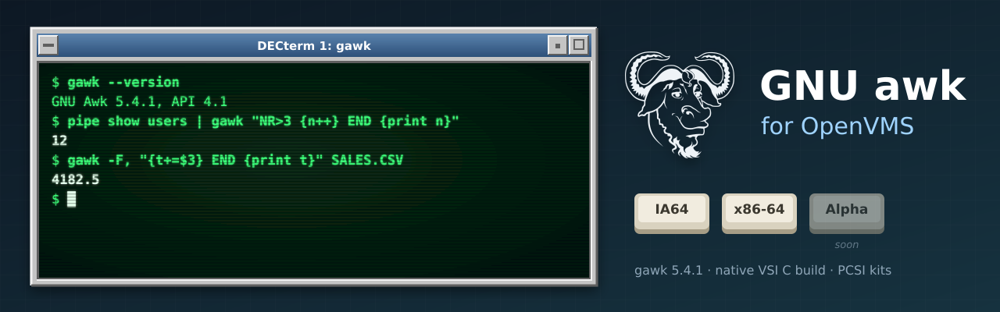

<p align="center">
  
</p>

# GNU awk (gawk) for OpenVMS

A build of current GNU awk (gawk) for OpenVMS on **IA64** and **x86-64**, following gawk's
own releases in lock-step rather than VSI's release cycle. This port starts from
**gawk 5.4.1**. It is part of the same family as
[GNU grep](https://github.com/issinoho/vms-grep) and
[GNU sed](https://github.com/issinoho/vms-sed) for OpenVMS.

Unlike grep and sed, **gawk ships its own OpenVMS port**: the release tarball has a `vms/`
directory (MMS description, `config_h.com`, VMS-specific sources, the `vmstest.com` test
driver), maintained upstream and updated with every release. This repository builds with
it, and holds **only our changes**: every build starts from the signed release tarball,
applies our patches (where upstream's VMS port lags, or VSI C needs a fix) and adds our own
VMS files in `vmsport/`.

## Status

| | IA64 (OpenVMS V8.4-2L3, VSI C 7.4) | x86-64 (OpenVMS E9.2-4, VSI C 7.7) |
|---|---|---|
| Builds with upstream's MMS description | yes | yes |
| Upstream VMS test suite (412 tests) | 386 pass, 0 fail | 388 pass, 0 fail |
| DCL smoke test (16 checks) | 16/16 | 16/16 |
| PCSI kit (`ISSINOHO-<base>-GAWK-V0504-1E1-1.PCSI`) | built | built |

See [docs/TESTING.md](docs/TESTING.md) for the results and every skipped test.

## Using gawk on OpenVMS

- **Defining the command:** `$ gawk :== $dev:[dir]GAWK.EXE`, or put the directory in
  `DCL$PATH`.
- **Quote the program.** Under the default `PARSE_STYLE=TRADITIONAL`, DCL upper-cases
  unquoted arguments and the C runtime then lower-cases them. Quote awk programs and
  upper-case options, and double the quotes inside: `gawk "{ print $1 }" file.txt`,
  `gawk "BEGIN { print ""hello"" }"`. `$ SET PROCESS/PARSE_STYLE=EXTENDED` keeps the case
  of unquoted arguments too.
- **Redirection and pipes** in awk programs (`print > "file"`, `print | "command"`,
  `"command" | getline`) are handled by gawk's VMS port; commands run with DCL.
- **Messages** say `gawk:` as on other systems (patch 0002).

## Repository layout

```
upstream.conf          upstream version, tarball URL, SHA-256, signing key
patches/               unified diffs against the upstream tree, applied in order (series)
overlay/vmsport/       our VMS files (upstream owns vms/): BUILD.COM, TEST_SMOKE.COM, kit
tools/                 host-side scripts: fetch, prepare, push, build, vmstest
docs/                  testing, images
cache/ staging/ out/   generated locally, not committed
```

## Patches

| Patch | Purpose |
|---|---|
| 0001 | `vms/config_h.com`: comment out an `#if` whose condition continues over several lines (autoconf's C23 `bool` check, new in 5.4.1). It was turned into broken C and nothing compiled. |
| 0002 | `vms/gawkmisc.vms`: `gawk_name` strips the image path when the device name has a node or allocation class prefix (`MYI64$DKA800`, `X86VMS$DKA0`), so messages say `gawk:`. |
| 0003 | `vms/vmstest.com`: follow upstream's test changes (`rscompat` with `--posix`, the five-pattern `colonwarn`), and name `longwrds`' SORT output explicitly (x86-64 SORT put it on `SYS$INPUT:`). |
| 0004 | `printf.c`: VSI C on IA64 dropped `if (x == -0) x = 0;`, so `printf "%d", -0.4` printed `-0`; use `fabs()` on VMS. |

Patches 0001–0003 change upstream's `vms/` port and could go back to its maintainer.

## How to build

The Linux host only fetches, verifies and patches the release; gawk's own VMS port then
configures and builds it on the VMS system with VSI C and MMS.

### What you need

- **Linux host:** git, bash, python3, curl and gpg. ssh/sftp too, for the automated route.
- **OpenVMS IA64 or x86-64:** VSI C and MMS. OpenSSH for the automated route. Tested on
  IA64 V8.4-2L3 with VSI C 7.4, and on x86-64 E9.2-4 with VSI C 7.7.

### 1. Prepare the source tree (Linux)

```sh
git clone https://github.com/issinoho/vms-awk.git
cd vms-awk
tools/prepare.sh
```

This downloads the gawk release named in `upstream.conf`, checks its SHA-256 and its GPG
signature against the GNU keyring, applies `patches/`, adds `overlay/`, and checks that
upstream's `vms/descrip.mms` covers every source file the Unix build compiles. The result
is in `staging/gawk-5.4.1/`.

### 2a. Build on VMS by hand

Copy the top-level files of `staging/gawk-5.4.1/` and its `vms/`, `vmsport/`, `support/`,
`missing_d/`, `posix/`, `extension/` and (for the tests) `test/` directories to the VMS
system. Then:

```
$ SET DEFAULT dev:[dir.GAWK-5_4_1]
$ @[.VMSPORT]BUILD                ! upstream's MMS build -> GAWK.EXE
$ SET DEFAULT [.TEST]
$ @[-.VMS]VMSTEST.COM             ! upstream's VMS test suite
```

`@[.VMSPORT]BUILD CLEAN` runs upstream's `spotless` target.

### 2b. Build on VMS from the host over ssh

Set up `tools/nodes.conf` and an ssh key as described in
[vms-grep's README](https://github.com/issinoho/vms-grep#2b-build-on-vms-from-the-host-over-ssh);
the same file works for every project. Then:

```sh
tools/build.sh ia64         # upload changed files, upstream's MMS build on the node
tools/vmstest.sh ia64       # upstream's VMS test suite as a batch job
tools/test.sh ia64          # our DCL smoke test
tools/kit.sh ia64           # build, then make the PCSI kit -> out/kits/
```

Kit versions follow upstream's own scheme for gawk's three-part versions: the third part
is the PCSI update and our VMS patch level the ECO, so gawk 5.4.1-vms1 is `V5.4-1E1`.

## Roadmap

1. A PCSI kit (`ISSINOHO <base> GAWK`) and a release.
2. Send patches 0001–0003 to gawk's VMS port maintainer.
3. A port to OpenVMS **Alpha**, alongside IA64 and x86-64.
4. Next ports: **GNU wget** ([vms-wget](https://github.com/issinoho/vms-wget)), then
   **curl** ([vms-curl](https://github.com/issinoho/vms-curl)). VSI ships a curl kit, but on
   VSI's slower release cycle; this port will follow curl's own releases in lock-step.

Earlier ports: [GNU grep](https://github.com/issinoho/vms-grep),
[PCRE2](https://github.com/issinoho/vms-pcre2) and [GNU sed](https://github.com/issinoho/vms-sed).

## Artwork

`docs/images/banner.svg` and `docs/images/icon.svg` were made for this project in the style of
classic DECwindows and VT terminals. They incorporate the
[GNU head](https://www.gnu.org/graphics/heckert_gnu.html) by Aurelio A. Heckert, © 2003 Free
Software Foundation, Inc., used under the Creative Commons Attribution-ShareAlike 2.0 licence.
The two images are therefore also licensed under
[CC BY-SA 2.0](https://creativecommons.org/licenses/by-sa/2.0/).

## Licence

GNU awk is licensed under the GNU General Public License, version 3 or later. The patches
and the VMS build files in this repository are distributed under the same terms; see
`COPYING`.

OpenVMS is a trademark of VMS Software, Inc. This project is not affiliated with VMS
Software, Inc., with the Free Software Foundation or with the GNU Project.
